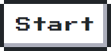

##
<h1 align="center">Hello there 👋, I'm Luca Morgado</h1>

- 🌱 I’m currently learning **TCP and UDP request handeling in golang**

- 📫 You can reach me at : **luca.morgado.pro@gmail.com**

<h3 align="left">Connect with me:</h3>

<h3 align="left">Languages and Tools:</h3>

            

# GameBoy :
</img>

 
  
 
  

&nbsp;

  

